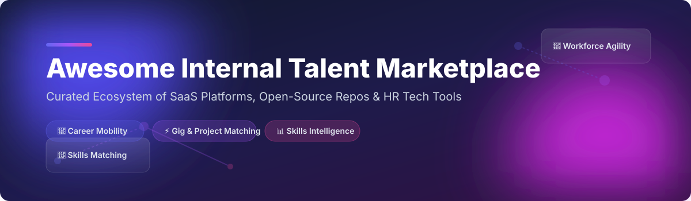

# 🌟 Awesome Internal Talent Marketplace 🚀

<p align="center">
  
</p>

<p align="center">
  <a href="https://github.com/ishandutta2007/Awesome-Awesome-Awesome"></a><a href="https://discord.gg/jc4xtF58Ve"></a>
  <a href="https://github.com/ishandutta2007/Awesome-Internal-Talent-Marketplace"></a>
  <a href="https://github.com/ishandutta2007/Awesome-Internal-Talent-Marketplace/network/members"></a>
  <a href="https://github.com/ishandutta2007/Awesome-Internal-Talent-Marketplace/issues"></a>
  <a href="https://github.com/ishandutta2007/Awesome-Internal-Talent-Marketplace/blob/main/LICENSE"></a>
  <a href="https://github.com/ishandutta2007"></a>
</p>

---

## 💡 Top Internal Talent Marketplace Platforms & Open-Source Ecosystem 💼

Welcome to the ultimate curated list of **SaaS platforms**, **HR tech enterprise software**, and **open-source GitHub repositories** for **Internal Talent Marketplaces (ITM)**, **skills matching engines**, and **workforce agility solutions**.

Internal Talent Marketplaces leverage AI and skills taxonomies to match employees with internal job openings, short-term gigs, cross-functional projects, mentorships, and personalized career pathways. Implementing ITM solutions improves employee retention, unlocks hidden organizational talent, and accelerates workforce transformation.

---

## 📌 Table of Contents

- [📈 Market Overview & Size](#-market-overview--size)
- [🏢 SaaS & Enterprise Platforms](#-saas--enterprise-platforms)
- [🔓 Open-Source GitHub Projects](#-open-source-github-projects)
- [🤝 How to Contribute](#-how-to-contribute)
- [☕ Support & Community](#-support--community)
- [📈 Star History](#-star-history)
- [⚠️ Disclaimer](#%EF%B8%8F-disclaimer)

---

## 📈 Market Overview & Size

> [!NOTE]
> **Estimated Market Size & Structure**: The global Internal Talent Marketplace and Workforce Agility software market is estimated at **$1.8 Billion – $2.5 Billion**, growing at a CAGR of **~18.5%**. The sector is **moderately fragmented**: mega-HRIS suites (Workday, SAP, Oracle) hold massive enterprise install bases, while specialized pure-play AI vendors (Eightfold AI, Gloat, Phenom, Fuel50) lead advanced skills inference and gig-matching UX.

---

## 🏢 SaaS & Enterprise Platforms

Below is a structured overview of top enterprise SaaS platforms providing internal talent marketplaces, career pathing, and skills intelligence. *Sorted by Company Size / Market Valuation (Descending).*

| Platform 🚀 | Description 📝 | Company Size / Valuation 💰 | Specific Starting Pricing 💲 | Free Forever Tier / Free Trial Limits ⏱️ |
| :--- | :--- | :--- | :--- | :--- |
| **[Workday Opportunity Marketplace](https://www.workday.com/)** 🏢 | Comprehensive internal opportunity marketplace integrated within Workday HCM. | **~$47 Billion** (Market Cap) | **~$6.00 / employee / month** (as part of enterprise HCM suite) | **No Free Trial** (Sales demo upon enterprise inquiry) |
| **[Eightfold AI](https://eightfold.ai/)** 🤖 | AI-powered talent intelligence and skills inference platform for enterprise mobility. | **~$2.10 Billion** (Series E valuation) | **~$7.00 / employee / month** (billed annually for enterprise) | **No Free Trial** (Guided product demo required) |
| **[Phenom Talent Marketplace](https://www.phenom.com/)** 🔮 | Talent experience platform matching employees to gigs, projects, and career paths. | **~$1.42 Billion** (Series E valuation) | **~$5.50 / employee / month** (enterprise contract base) | **No Free Trial** (Custom demo environment provided on request) |
| **[Gloat](https://gloat.com/)** 🌐 | Pioneer AI talent marketplace powering gig matching and workforce agility. | **~$1.00 Billion** (Est. Series D valuation) | **~$5.00 / employee / month** (enterprise tier starting rate) | **No Free Trial** (Enterprise demo & ROI assessment required) |
| **[SAP Opportunity Marketplace](https://www.sap.com/)** 🏛️ | Opportunity marketplace built natively inside SAP SuccessFactors suite. | **~$250+ Billion** (SAP Group Market Cap) | **~$5.00 / employee / month** (SuccessFactors add-on pricing) | **30-Day Free Trial** (SAP PartnerEdge / Demo environment access) |
| **[Oracle Opportunity Marketplace](https://www.oracle.com/)** ☁️ | Internal mobility and gig matching engine inside Oracle Fusion Cloud HCM. | **~$380+ Billion** (Oracle Corp Market Cap) | **~$4.00 / employee / month** (HCM Cloud module pricing) | **30-Day Free Trial** (Oracle Cloud Free Tier & Guided Demo) |
| **[Cornerstone Opportunity Marketplace](https://www.cornerstoneondemand.com/)** 📚 | Learning-connected opportunity marketplace linking skill development to gigs. | **~$5.20 Billion** (Private Equity Acquisition) | **~$4.50 / employee / month** (LMS/Talent suite tier) | **No Free Trial** (Custom enterprise demo upon request) |
| **[Fuel50](https://fuel50.com/)** 🧬 | AI career pathing platform centered on personalized "Career DNA" and internal gigs. | **~$150 Million** (Est. valuation; ~$36M funding) | **~$4.00 / employee / month** (starting tier) | **No Free Trial** (Interactive sandbox access post-demo) |
| **[TechWolf](https://techwolf.ai/)** 🐺 | AI skills intelligence layer powering skills-based internal matching engines. | **~$120 Million** (Est. valuation; ~$43M funding) | **~$3.50 / employee / month** (API & intelligence layer) | **No Free Trial** (Proof-of-Concept trial available for enterprise clients) |
| **[50skills](https://50skills.com/)** ⚡ | Talent onboarding and internal mobility workflows for growing organizations. | **~$15 Million** (Est. valuation) | **$199.00 / month** (Starting team plan) | **14-Day Free Trial** (Full access, no credit card required) |
| **[PeopleFluent](https://www.peoplefluent.com/)** 👥 | Talent management & mobility suite tailored for mid-market and enterprise teams. | **~$100 Million** (LTG Group Division) | **~$3.00 / employee / month** (base talent module) | **No Free Trial** (Personalized product walkthrough required) |
| **[Flexa Careers](https://flexa.co/)** 🌈 | Platform highlighting flexible work options and internal/external talent matching. | **~$10 Million** (Est. seed stage valuation) | **£150.00 / month** (Employer starting tier) | **7-Day Free Trial** (Company profile setup & job listing preview) |

---

## 🔓 Open-Source GitHub Projects

Full enterprise-grade internal talent marketplaces are predominantly commercial. However, open-source building blocks—such as **HRMS platforms**, **skills rating engines**, **job board engines**, and **workflow automation tools**—can be assembled into powerful internal mobility solutions.

*Sorted by GitHub Star Count (Descending).*

| Project 📦 | Repository & Star Badge ⭐ | Description 📝 |
| :--- | :--- | :--- |
| **Odoo** 🟣 | [](https://github.com/odoo/odoo/stargazers) | Open-source enterprise management software with comprehensive HR, employee profile, and internal recruitment modules. |
| **ERPNext** 🟢 | [](https://github.com/frappe/erpnext/stargazers) | Modern open-source ERP featuring robust HR management, employee skill tagging, and job opening workflows. |
| **Activepieces** ⚡ | [](https://github.com/activepieces/activepieces/stargazers) | Open-source no-code business automation tool to connect HR systems with internal gig assignment workflows. |
| **ILLA Builder** 🛠️ | [](https://github.com/illacloud/illa-builder/stargazers) | Low-code tool to rapidly build custom internal talent portals, skill submission forms, and project dashboards. |
| **Ever Gauzy** 💼 | [](https://github.com/ever-co/ever-gauzy/stargazers) | Open-source Business Management & HR platform featuring employee management, time tracking, and task allocation. |
| **Dolibarr ERP/CRM** 🔵 | [](https://github.com/Dolibarr/dolibarr/stargazers) | Open-source ERP/HR suite featuring employee profiles, skills management, and internal task assignments. |
| **Frappe HR** 🟠 | [](https://github.com/frappe/hrms/stargazers) | Purpose-built open-source HR and talent management system with performance tracking and skill inventories. |
| **OrangeHRM** 🍊 | [](https://github.com/orangehrm/orangehrm/stargazers) | Popular open-source HR software suite covering talent management, performance evaluation, and recruitment. |
| **OpenCATS** 🐱 | [](https://github.com/opencats/OpenCATS/stargazers) | Dedicated open-source Applicant Tracking System (ATS) customizable for internal job application tracking. |
| **Openskill.js** 🧮 | [](https://github.com/philihp/openskill.js/stargazers) | Open-source skill rating and ranking library useful for algorithmically matching talent to projects. |

---

## 🛠️ Framework for Building a Custom Open-Source Talent Marketplace

If you prefer building an internal marketplace using open-source tools:

```
[Employee Profiles / Skills Tagging (Frappe HR / OrangeHRM)]
                        │
                        ▼
[Internal Opportunity Listing (OpenCATS / ERPNext)]
                        │
                        ▼
[Skill-to-Gig Vector / Algorithmic Matching (Openskill.js)]
                        │
                        ▼
[Automated Notifications & Routing (Activepieces / ILLA Builder)]
```

---

## 🤝 How to Contribute

Contributions are warmly welcomed! Help us keep this ecosystem list up-to-date and comprehensive. 🌟

1. 🍴 **Fork** this repository.
2. 🌿 Create a feature branch (`git checkout -b feature/add-new-platform`).
3. 📝 Update `README.md` with accurate details (links, descriptions, pricing/stars).
4. 📬 Submit a **Pull Request** with a clear explanation of your changes.

---

## ☕ Support & Community

If you find this repository valuable for your HR tech research or talent strategy, please consider supporting the project:

- ⭐ **Star this repository** to increase its visibility on GitHub.
- 🔄 **Fork & Share** with fellow HR technologists and workforce leaders.
- 💬 Join our community discussion on [Discord](https://discord.gg/jc4xtF58Ve).
- 💖 **Sponsor the Maintainer**: Support ongoing open-source curation via [GitHub Sponsors](https://github.com/sponsors/ishandutta2007).

---

## 📈 Star History

[](https://star-history.dera.page/#ishandutta2007/Awesome-Internal-Talent-Marketplace&type=date&legend=top-left)

---

## ⚠️ Disclaimer

- This repository is a **community-curated index** for informational purposes only.
- Financial metrics (valuations, revenue estimates) and pricing data are gathered from public research and industry disclosures; they may vary over time.
- Processing employee career and skill data requires compliance with labor regulations and privacy standards (e.g., GDPR). Always perform legal and data governance reviews before deploying talent marketplace solutions.

---

<p align="center">
  Made with ❤️ for HR technologists, talent leaders, and workforce agility champions.
</p>
